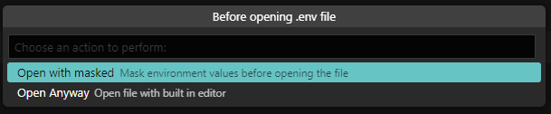
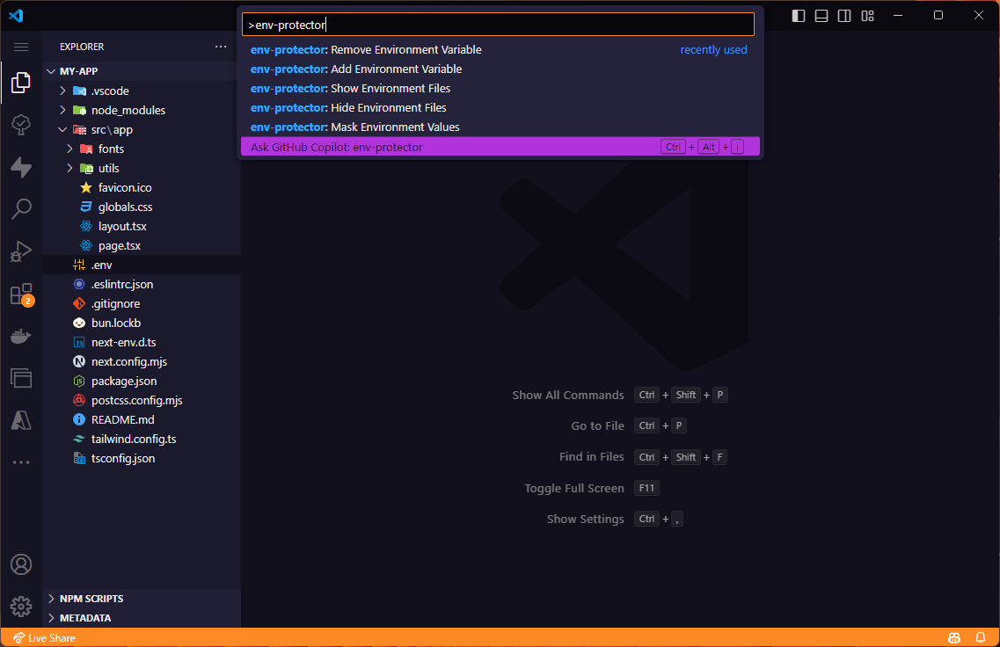
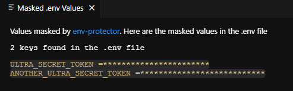

# env-protector README

## Features

- Toggle visibility of environment files in the sidebar. This command modifies your workspace settings by adding `"**/.env*": true` to the `files.exclude` section in your `settings.json`.
- Asks you to confirm opening an environment file.
- Mask sensitive environment variables in your environment files.

## Manual Installation

1. Download the `.vsix` file from the releases page.
2. Open Visual Studio Code.
3. Go to the Extensions view by clicking the Extensions icon in the Activity Bar on the side of the window.
4. Click on the ellipsis (...) in the top right corner of the Extensions view.
5. Select "Install from VSIX..." and choose the downloaded `.vsix` file.

## Contributing

If you would like to contribute to the development of this extension, please follow these steps:

1. Fork the repository.
2. Create a new branch for your feature or bugfix.
3. Submit a pull request with a detailed description of your changes.
