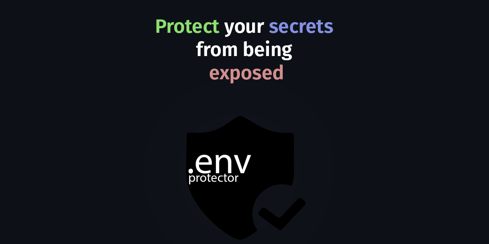
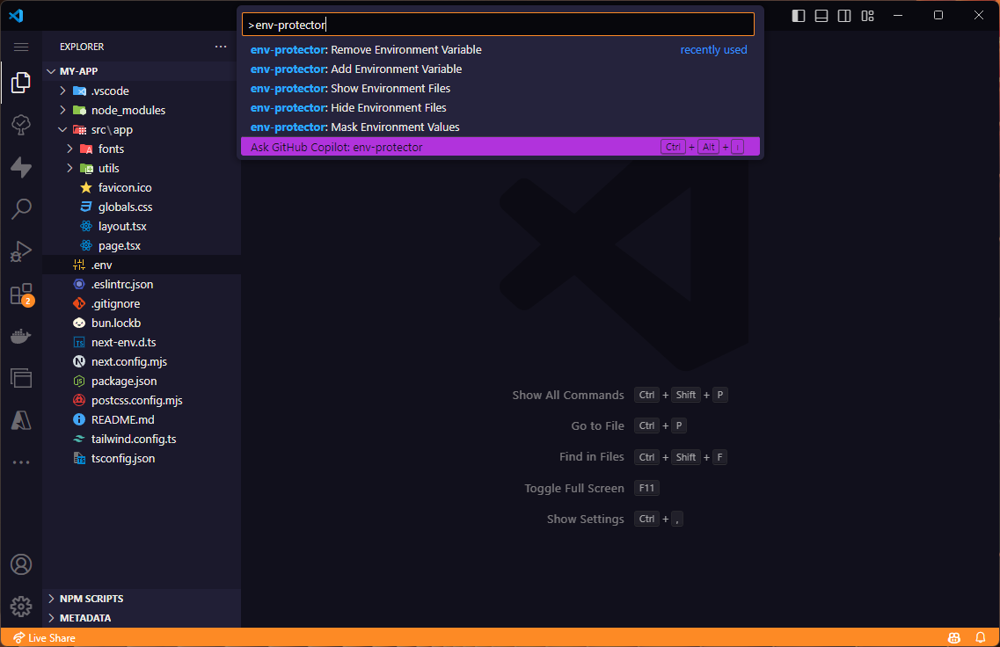
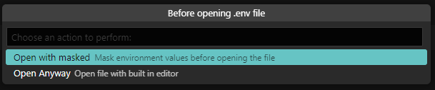
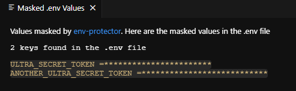
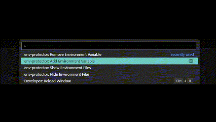
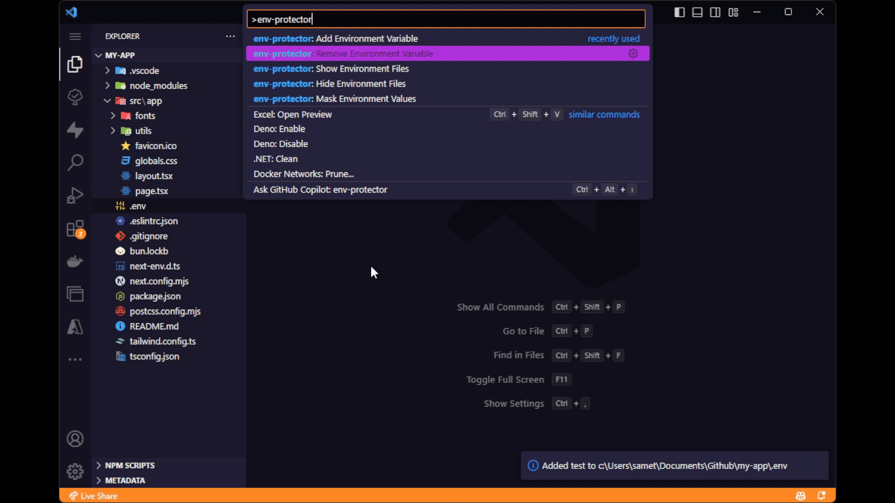

# Env Protector


[](https://marketplace.visualstudio.com/items?itemName=sametcn99.env-protector)
[](https://open-vsx.org/extension/sametcn99/env-protector)



## Why this extension?

In the modern development era, live streaming, screen sharing, and recording are part of daily routines. However, most existing VS Code extensions that manage environment variables have a critical flaw: they process `.env` files only *after* the file has been opened. This results in a brief millisecond window where sensitive keys, API tokens, and passwords might be visible on screen before being hidden or masked. For streamers and security-conscious developers, this split-second exposure is unacceptable.

**Env Protector** solves this problem essentially by intercepting the file open request. Instead of reacting to an opened file, it proactively asks you *how* you want to view the file before it is rendered. This "security-first" architecture ensures that sensitive data never hits the screen unless you explicitly authorize it, providing a robust layer of privacy for your development environment.

## Features

- **File Visibility Control**: The extension allows you to toggle the visibility of environment files (e.g., .env) within the VS Code sidebar. It automates the management of `files.exclude` in your workspace settings, hiding sensitive files from the file explorer view to prevent accidental clicks during screen shares.
  

- **Proactive Interception Prompt**: Unlike other tools, this extension intercepts the request to open an enviroment file. It presents a confirmation dialog asking how you wish to proceed, ensuring you are always aware before sensitive context is loaded into the editor buffer.
  

- **Secure Masked View**: When you choose to view a file securely, the extension renders a virtual document where all values are replaced with asterisks (masking). This allows you to verify the presence of keys and structure without exposing the actual secrets (values).
  

- **Safe Variable Management**: Manage your environment variables without ever opening the file itself:
  - **Add Variable**: Insert new key-value pairs via the Command Palette.
  - **Edit Variable**: Modify existing values safely through input boxes.
  - **Remove Variable**: Delete keys without exposing the rest of the file content.
  
  
  
  

## Installation

You can install **Env Protector** either from the Visual Studio Code marketplace or manually using the steps below:

### Manual Installation

1. Download the `.vsix` file from the [releases page](https://github.com/sametcn99/env-protector/releases).
2. Open Visual Studio Code.
3. Navigate to the **Extensions** view by clicking the Extensions icon in the Activity Bar.
4. Click the ellipsis (...) in the top right corner of the Extensions view.
5. Select "Install from VSIX..." and choose the downloaded `.vsix` file.

## Building from Source

If you want to build **Env Protector** from source, follow these steps:

### Prerequisites

- **Node.js** (version 14 or higher)
- **npm** (comes with Node.js)
- **Git**

### Build Steps

1. **Clone the repository**:

   ```bash
   git clone https://github.com/sametcn99/env-protector.git
   cd env-protector
   ```

2. **Install dependencies**:

   ```bash
   npm install
   ```

3. **Compile the extension**:

   ```bash
   npm run compile
   ```

4. **Package the extension** (optional):

   ```bash
   npm run vsce
   ```

   This will create a `.vsix` file that you can install manually.

### Development Mode

For development and testing purposes, you can run the extension in watch mode:

```bash
npm run watch
```

This will automatically recompile the extension whenever you make changes to the source code.

#### Running with VS Code Run and Debug

You can also run and debug the extension directly within VS Code:

1. **Open the project in VS Code**:

   ```bash
   code .
   ```

2. **Start the watch task** (optional but recommended):
   - Press `Ctrl+Shift+P` (or `Cmd+Shift+P` on Mac)
   - Type "Tasks: Run Task"
   - Select "npm: watch" to start automatic compilation

3. **Launch the Extension Development Host**:
   - Press `F5` or go to `Run and Debug` view (`Ctrl+Shift+D`)
   - Select "Run Extension" from the dropdown
   - Click the play button or press `F5`

This will open a new VS Code window (Extension Development Host) with your extension loaded. You can test all the extension features in this environment, and any changes you make to the code will be reflected after reloading the window (`Ctrl+R` in the Extension Development Host).

## Contributing

Contributions are highly welcome! If you'd like to help improve **Env Protector**, please follow these steps:

1. Fork the repository to your own GitHub account.
2. Create a new branch for your feature or bug fix.
3. Make your changes and test them thoroughly.
4. Submit a pull request, describing your changes in detail.

Together, we can make **Env Protector** an even more valuable tool for the community!  
Thank you for your contributions!

## Support

If you find this extension helpful, please consider **starring the repository** on GitHub! It helps the project gain visibility and encourages further development.

[](https://github.com/sametcn99/env-protector)

## License

This project is licensed under the [GPL-3.0 license](LICENSE).
